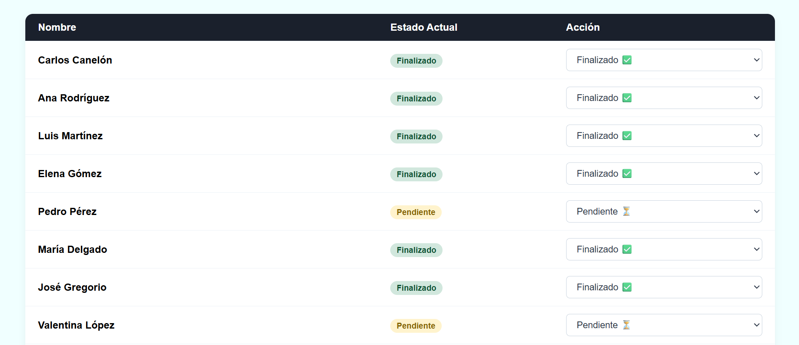
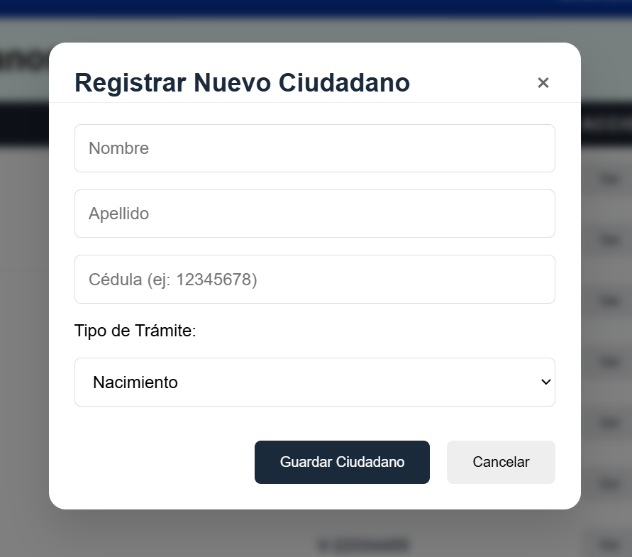
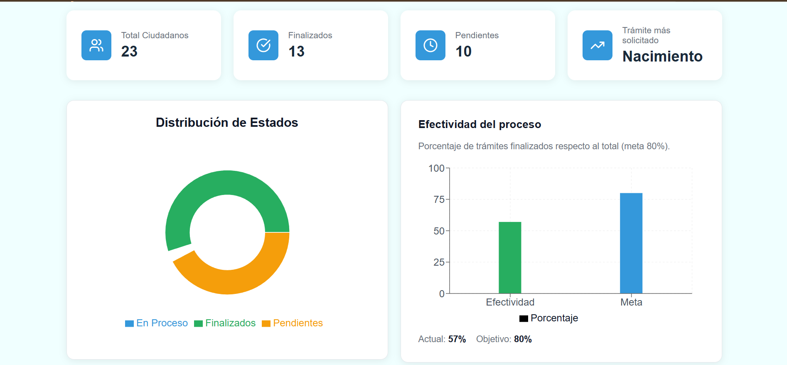

# CivicFlow


**CivicFlow** es una aplicación web para la **gestión digital de registros civiles y trámites ciudadanos**. Centraliza ciudadanos, estados de trámites (Nacimiento, Defunción, Matrimonio) y métricas en tiempo real, reduciendo la carga administrativa y mejorando la trazabilidad de los procesos.

---

## Tecnologías utilizadas

| Categoría | Tecnología |
|-----------|------------|
| **Frontend** | React 19, TypeScript, Sass (CSS Modules) |
| **Estado y consultas** | TanStack Query (React Query), React Router DOM |
| **Herramientas** | Vite, Lucide React (iconografía), Recharts (gráficos) |
| **API / datos** | Axios, JSON Server (API REST simulada) |

---

## Características principales

- **Filtrado de ciudadanos** por nombre, cédula o tipo de trámite para localizar registros de forma rápida.
- **Actualización de estados de trámites en tiempo real** (Pendiente, En proceso, Finalizado) con invalidación de caché y refetch automático.
- **Interfaz adaptativa** que se comporta correctamente en escritorio y dispositivos móviles.
- **Dashboard con métricas** y gráficos (estado de trámites, efectividad) para una visión global del sistema.
- **CRUD de ciudadanos** (crear, ver, editar, eliminar) con formularios validados y feedback visual.
- **Tablas y modales** para listar registros y gestionar detalles sin salir del flujo.

---

## Arquitectura

- **CSS Modules (Sass)**: Estilos encapsulados por componente (`.module.scss`), evitando conflictos de clases y facilitando el mantenimiento.
- **Estructura basada en componentes y hooks**:
  - `components/`: UI reutilizable (tablas, formularios, cards, gráficos, navbar).
  - `hooks/`: lógica de datos separada en `queries` (TanStack Query) y `mutations` (crear, actualizar, eliminar).
  - `pages/`: vistas por ruta (Dashboard, Ciudadanos/Registros, Trámites).
  - `layouts/`, `services/`, `api/`, `types/`: layout común, llamadas a API y tipos TypeScript.

---

## Instalación y uso

### Requisitos

- Node.js (v18 o superior recomendado)
- npm

### Pasos

1. **Clonar el repositorio** (o descargar el proyecto).

2. **Instalar dependencias:**

   ```bash
   npm install
   ```

3. **Iniciar el servidor de datos (API simulada):**

   En una terminal:

   ```bash
   npm run server
   ```

   El JSON Server estará disponible en `http://localhost:3001`.

4. **Iniciar la aplicación en modo desarrollo:**

   En otra terminal:

   ```bash
   npm run dev
   ```

   La app se abrirá en la URL que indique Vite (por ejemplo `http://localhost:5173`).

5. **Build para producción:**

   ```bash
   npm run build
   ```

6. **Previsualizar el build:**

   ```bash
   npm run preview
   ```

---

## Capturas de pantalla

| Vista | Captura |
|-------|---------|
| **Tablas** |  |
| **Modales** |  |
| **Dashboard** |  |

---

## Autor

**Carlos Canelón**  
Desarrollador frontend · [Perfil / Portfolio](https://github.com/tu-usuario)

---

*README generado para el proyecto CivicFlow — gestión digital de registros civiles y trámites ciudadanos.*
